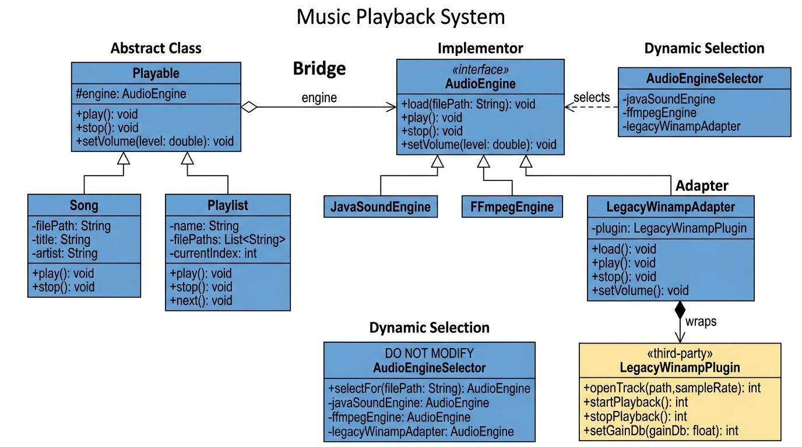

# Music Playback System (Assignment 3)

Design and implementation of a music playback system combining the **Bridge Pattern** and **Adapter Pattern** with the **Dynamic Implementor Selection** complexity module.

---

## 🎵 Overview

The system decouples what to play (**Abstraction**: single tracks `Song`, ordered `Playlist`) from how the audio is rendered (**Implementor**: `AudioEngine` hierarchy).

### Patterns Applied

1. **Bridge Pattern:**
   - **Abstraction:** `Playable` (holds reference to `AudioEngine`)
     - `Song` (Refined Abstraction 1)
     - `Playlist` (Refined Abstraction 2)
   - **Implementor:** `AudioEngine` interface
     - `JavaSoundEngine` (Concrete Implementor 1 — plays `.wav`, `.aiff` via `javax.sound.sampled`)
     - `FFmpegEngine` (Concrete Implementor 2 — plays `.mp3`, `.ogg`, `.aac` via `ffplay`)
     - `LegacyWinampAdapter` (Concrete Implementor 3 — Adapter wrapping legacy plugin)

2. **Adapter Pattern:**
   - Adapts the third-party `LegacyWinampPlugin` into the `AudioEngine` contract without modifying its source code.
   - Translates:
     - Method signatures: `openTrack(path, sampleRate)` ➔ `load(path)`, `startPlayback()` ➔ `play()`, `stopPlayback()` ➔ `stop()`.
     - Volume & parameter units: Decibels `float [-60, 0] dB` ➔ linear volume `double [0.0, 1.0]` ($20 \log_{10}(\text{level})$).
     - Error handling: Negative status codes (`-1` .. `-6`) ➔ unified `AudioException`.

3. **Complexity Module — Dynamic Implementor Selection:**
   - `AudioEngineSelector` analyzes the audio file extension at runtime and assigns the appropriate engine.
   - The client never hard-codes which concrete engine to use.

---

## 📊 UML Class Diagram



*(PlantUML source available in [`uml/class_diagram.puml`](uml/class_diagram.puml))*

---

## 🚀 Build & Run

### Prerequisites
- JDK 17 or higher
- Maven 3.8+

### Run Tests
```bash
mvn test
```
*Total: 43 tests covering normal delegation, cyclic playlist switching, error translation, volume conversions, and dynamic selection.*

### Run Demo
```bash
mvn compile exec:java -Dexec.mainClass="com.musicplayer.Main"
```

---

## 📁 Project Structure

```
music-player/
├── pom.xml
├── README.md
├── docs/
│   ├── design_rationale.md       # 2-page formal design rationale report
│   └── defense_cheat_sheet.md    # Oral defense Q&A preparation
├── uml/
│   ├── class_diagram.jpg         # Visual UML diagram
│   └── class_diagram.puml        # PlantUML diagram source
└── src/
    ├── main/java/com/musicplayer/
    │   ├── Main.java
    │   ├── engine/
    │   │   ├── AudioEngine.java
    │   │   ├── JavaSoundEngine.java
    │   │   ├── FFmpegEngine.java
    │   │   ├── LegacyWinampAdapter.java
    │   │   └── legacy/
    │   │       └── LegacyWinampPlugin.java
    │   ├── exception/
    │   │   └── AudioException.java
    │   ├── playable/
    │   │   ├── Playable.java
    │   │   ├── Song.java
    │   │   └── Playlist.java
    │   └── selector/
    │       └── AudioEngineSelector.java
    └── test/java/com/musicplayer/
        ├── SongTest.java
        ├── PlaylistTest.java
        ├── LegacyWinampAdapterTest.java
        └── AudioEngineSelectorTest.java
```
